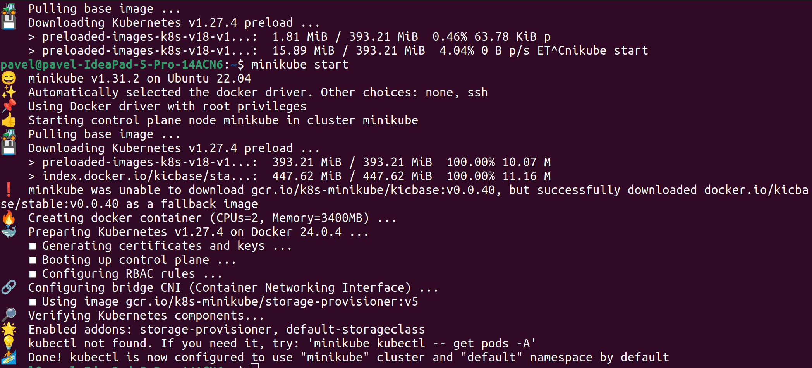

University: [ITMO University](https://itmo.ru/ru/)
Faculty: [FICT](https://fict.itmo.ru)
Course: [Introduction to distributed technologies](https://github.com/itmo-ict-faculty/introduction-to-distributed-technologies)
Year: 2023/2024
Group: K4110c
Author: Solovev Pavel Alekseevich
Lab: Lab1
Date of create: 29.09.2023
Date of finished: 21.10.2023

## Установка и запуск

Сквозь боль, страдания и мобильный интернет