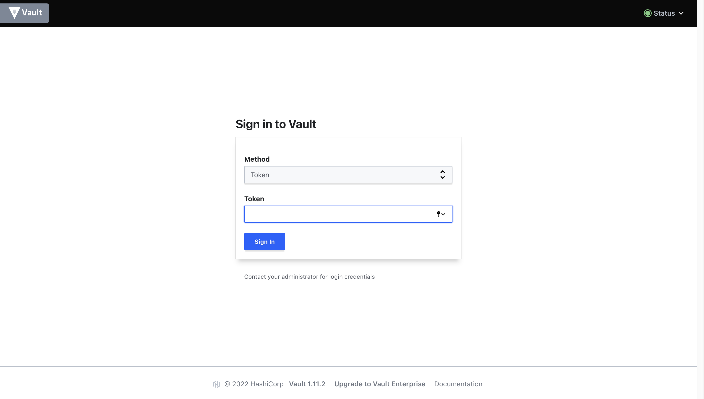

University: [ITMO University](https://itmo.ru/ru/)\
Faculty: [FICT](https://fict.itmo.ru)\
Course: [Introduction to distributed technologies](https://github.com/itmo-ict-faculty/introduction-to-distributed-technologies)\
Year: 2023/2024\
Group: K4110c\
Author: Solovev Pavel Alekseevich\
Lab: Lab1\
Date of create: 29.09.2023\
Date of finished: -

## Установка и запуск


Сквозь боль, страдания и мобильный интернет Minikube установлен.

```yaml
apiVersion: apps/v1
kind: Deployment
metadata:
  name: vault
  labels:
    app: vault
    owner: solovev
spec:
  selector:
    matchLabels:
      app: vault
  replicas: 2 
  template:
    metadata:
      labels:
        app: vault
    spec:
      containers:
      - name: vault
        image: vault:1.13.3
        ports:
        - containerPort: 8200

---
apiVersion: v1
kind: Service
metadata:
  name: vault
  labels:
    run: vault
spec:
  ports:
  - port: 8200
    targetPort: 8200
    protocol: TCP
  selector:
    app: vault
```

Написан .yaml манифест для развертывания пода.


Применяем написанный манифест.


Создаем сервис для получения доступа к поду и пробрасываем порты.


Смотрим описание запущенного сервиса.



Под запустился, видим пользовательский интерфейс по проброшенному порту.


По подсказке и чтении доки догадываемся о месторасположении токена. Ищем в логах командой
```bash
minikube kubectl logs vault-5b56bbdcc8-27469
```