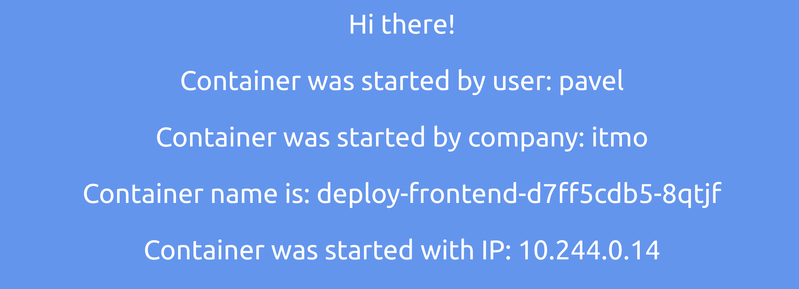
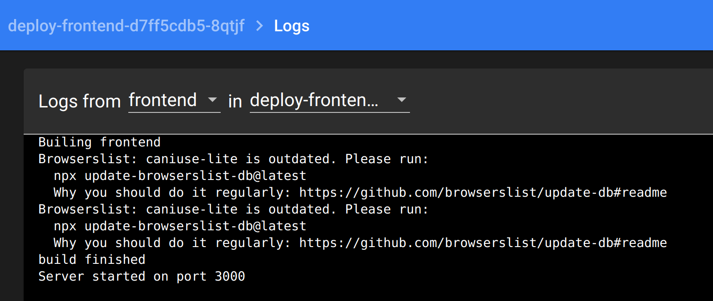
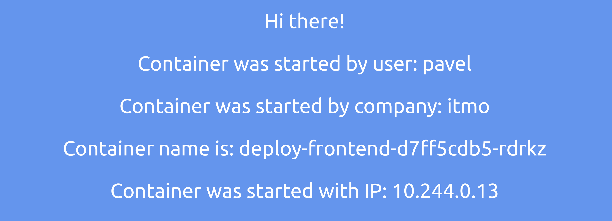
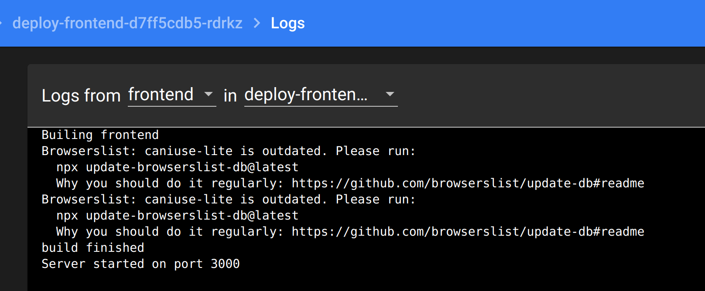
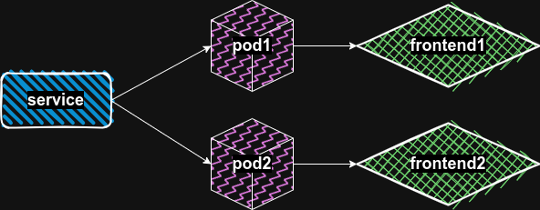

University: [ITMO University](https://itmo.ru/ru/)\
Faculty: [FICT](https://fict.itmo.ru)\
Course: [Introduction to distributed technologies](https://github.com/itmo-ict-faculty/introduction-to-distributed-technologies)\
Year: 2023/2024\
Group: K4110c\
Author: Solovev Pavel Alekseevich\
Lab: Lab2\
Date of create: 29.09.2023\
Date of finished: 02.11.2023

## Выполнение работы

Первым делом правим разработанный в прошлой ЛР deployment.

```yaml
apiVersion: apps/v1
kind: Deployment
metadata:
  name: deploy-frontend
  labels:
    app: frontend
    owner: solovev
spec:
  selector:
    matchLabels:
      app: frontend
  replicas: 2 
  template:
    metadata:
      labels:
        app: frontend
    spec:
      containers:
      - name: frontend
        image: ifilyaninitmo/itdt-contained-frontend:master
        ports:
        - containerPort: 3000
        env:
        - name: REACT_APP_USERNAME
          value: pavel
        - name: REACT_APP_COMPANY_NAME
          value: itmo

---
apiVersion: v1
kind: Service
metadata:
  name: service-frontend
  labels:
    run: frontend
spec:
  ports:
  - port: 3000
    targetPort: 3000
    protocol: TCP
  selector:
    app: frontend
```

Через env передаем переменные. Из неочевидного - в тексте задания не приводится порт, на котором работает приложение. Нужный порт был найден на докер хабе, что было не сразу очевидно.

Применям деплоймент и можно поднимать поды.


Достукиваемся до первого пода, проверяем енвы.



Смотрим логи через minikube dashboard. Можно и в терминале, но интересно глянуть на веб морду.



Второй под также запустился, енвы отличаются от первого. Все корректно.



Логи второго пода.



Схема организации системы.

