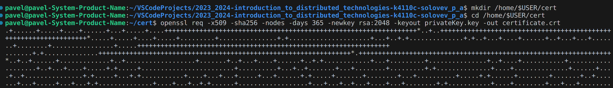
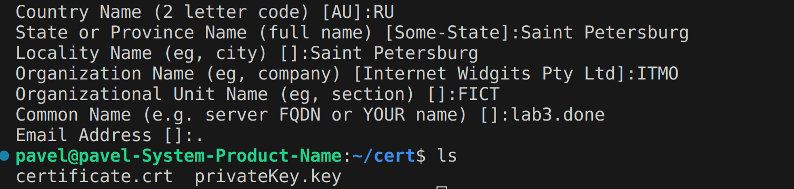
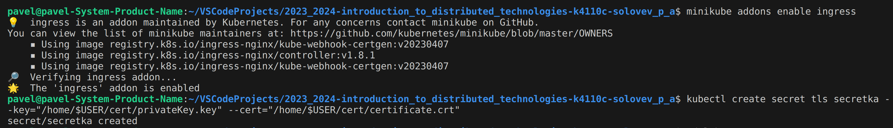
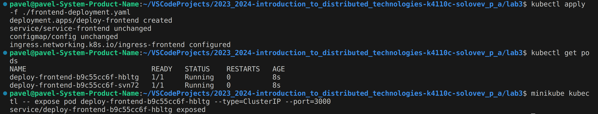
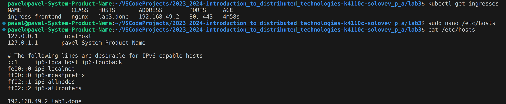
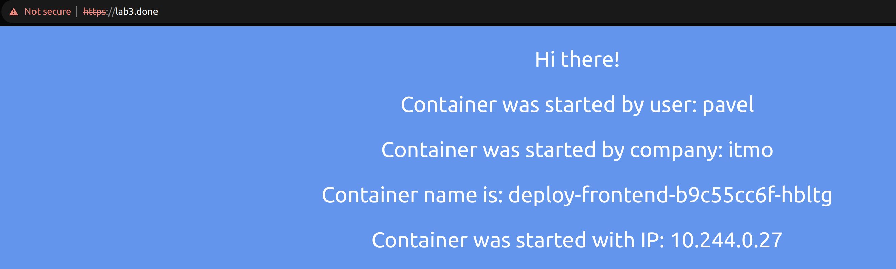
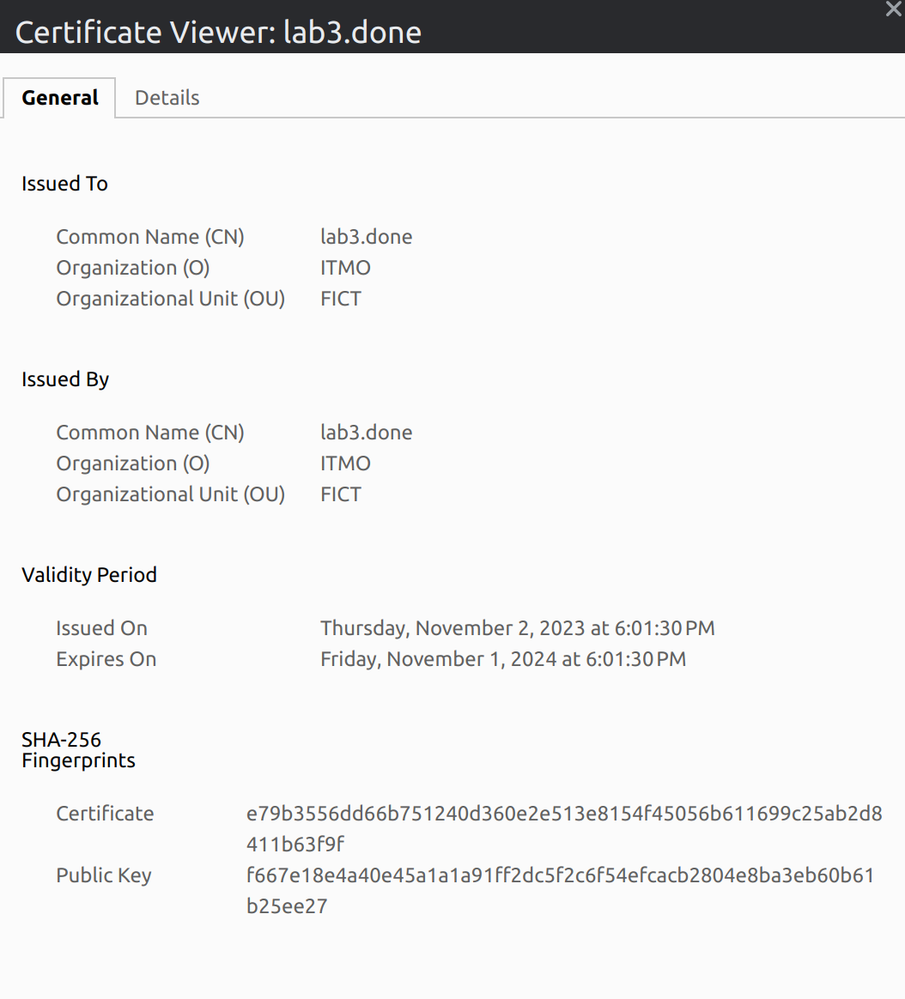
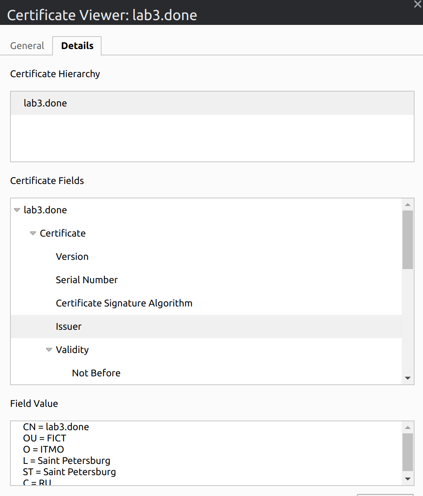
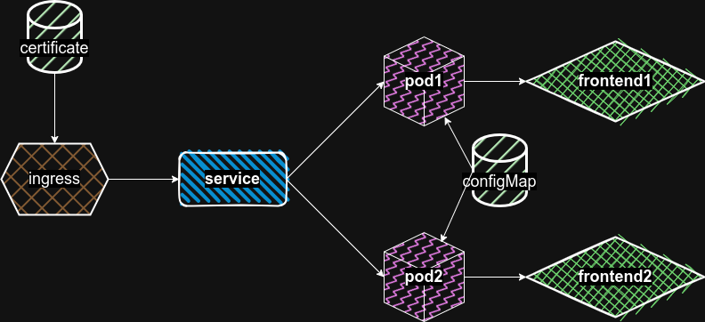

University: [ITMO University](https://itmo.ru/ru/)\
Faculty: [FICT](https://fict.itmo.ru)\
Course: [Introduction to distributed technologies](https://github.com/itmo-ict-faculty/introduction-to-distributed-technologies)\
Year: 2023/2024\
Group: K4110c\
Author: Solovev Pavel Alekseevich\
Lab: Lab3\
Date of create: 29.10.2023\
Date of finished: 02.11.2023

## Выполнение работы

Первым делом создаем configMap вместо env.

```yaml
apiVersion: v1
kind: ConfigMap
metadata:
  name: config
data:
  REACT_APP_USERNAME: pavel
  REACT_APP_COMPANY_NAME: itmo
```

Меням деплоймент из прошлой лабы под текущие требования.

```yaml
apiVersion: apps/v1
kind: Deployment
metadata:
  name: deploy-frontend
  labels:
    app: frontend
    owner: solovev
spec:
  selector:
    matchLabels:
      app: frontend
  replicas: 2 
  template:
    metadata:
      labels:
        app: frontend
    spec:
      containers:
      - name: frontend
        image: ifilyaninitmo/itdt-contained-frontend:master
        ports:
        - containerPort: 3000
        envFrom:
          - configMapRef:
              name: config

---
apiVersion: v1
kind: Service
metadata:
  name: service-frontend
  labels:
    run: frontend
spec:
  ports:
  - port: 443
    targetPort: 3000
    protocol: TCP
  selector:
    app: frontend
```

Пишем ingress.

```yaml
apiVersion: networking.k8s.io/v1
kind: Ingress
metadata:
  name: ingress-frontend
spec:
  tls:
    - hosts:
        - lab3.done
      secretName: secretka
  rules:
    - host: lab3.done
      http:
        paths:
          - path: /
            pathType: Prefix
            backend:
              service:
                name: service-frontend
                port:
                  number: 443
```

Создаем самоподписанный TLS сертификат с помощью OpenSSL.




Поднимаем ingress и записываем наш сертификат.



Поднимаем поды.



Вписываем FQDN и ip ингресса в hosts.



Открываем интернет веб страницу сайт по адресу https://lab3.done



Смотрим сертификат.



Подробности сертификата с указанными ранее параметрами.



Схема организации системы.

