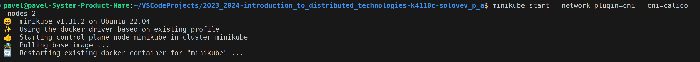
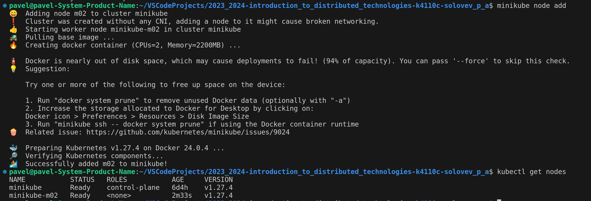
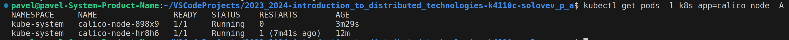
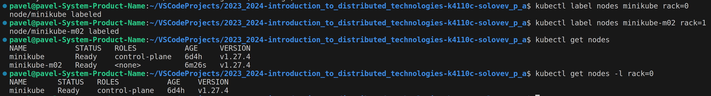
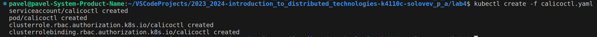
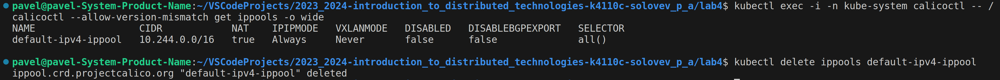
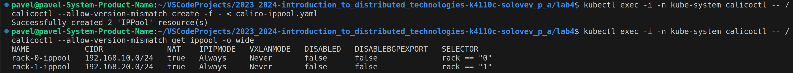
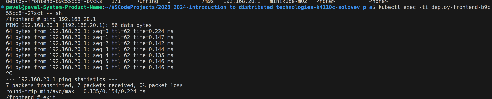
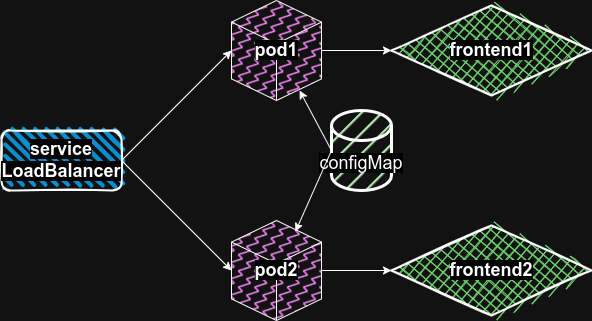

University: [ITMO University](https://itmo.ru/ru/)\
Faculty: [FICT](https://fict.itmo.ru)\
Course: [Introduction to distributed technologies](https://github.com/itmo-ict-faculty/introduction-to-distributed-technologies)\
Year: 2023/2024\
Group: K4110c\
Author: Solovev Pavel Alekseevich\
Lab: Lab4\
Date of create: 08.11.2023\
Date of finished: 09.11.2023

## Выполнение работы

Запускаем minikube с включенным calico и количеством нод равным 2.

Сразу не завелось, поднимаем еще одну ноду вручную.

Проверяем, запустились ли поды калико.

Назначаем метки нодам. Последней командой можно проверить, присвоились ли метки им.

Устанавливаем calicoctl.

С помощью вышеупомянутого инструмента удаляем стандартный ippool.

Создаем и проверяем новые ippool.

Экспоузим порт, порт-форвардим и попадаем на страничку сервиса. IP и Name меняются в зависимости от того, на какую ноду отправит нас LoadBalancer. Пробуем пингануть один под из-под второго и наоборот. Все успехово!

## Схема

